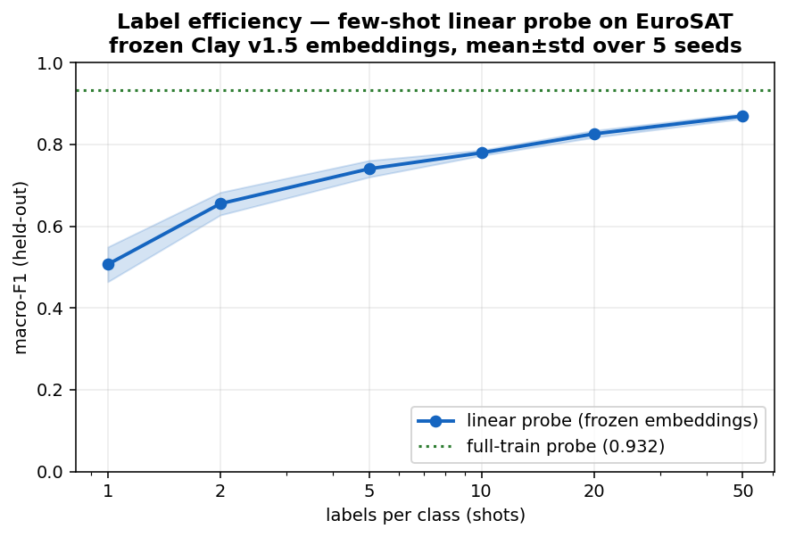
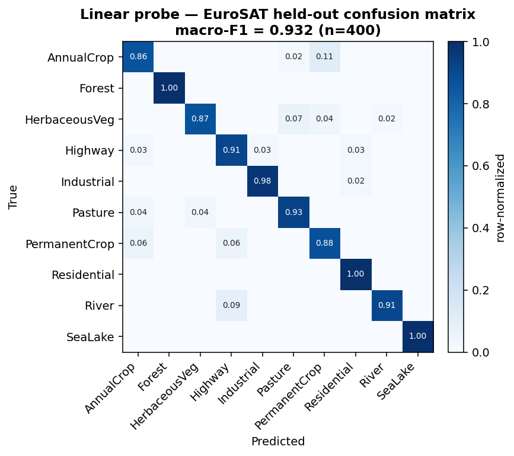

<!--
  Copyright 2026 Can Deniz Kaya

  Licensed under the Apache License, Version 2.0 (the "License");
  you may not use this file except in compliance with the License.
  You may obtain a copy of the License at

    http://www.apache.org/licenses/LICENSE-2.0

  Unless required by applicable law or agreed to in writing, software
  distributed under the License is distributed on an "AS IS" BASIS,
  WITHOUT WARRANTIES OR CONDITIONS OF ANY KIND, either express or implied.
  See the License for the specific language governing permissions and
  limitations under the License.
-->

# eo-data-embedding

**Multi-modal geospatial embedding search & change detection on a ViT foundation model.**

[](https://github.com/AstroCan17/eo-data-embedding/actions/workflows/ci.yml)
[](https://astrocan17.github.io/eo-data-embedding/)
[](https://www.python.org)
[](LICENSE)

Embed Earth-observation tiles **once** with a frozen [Clay v1.5](https://clay-foundation.github.io/model/)
Vision Transformer, then serve every downstream task — similarity search, few-shot
classification, change detection — cheaply over the stored vectors. No per-task
fine-tuning, no GPU at query time.


## Quickstart

The `demo` subcommand is plug-and-play and CPU-only — it downloads a small EuroSAT
subset plus a prebuilt bundle (precomputed embeddings + a trained probe) and serves
a live UI. No GPU, no Clay, no training required:

```bash
git clone https://github.com/AstroCan17/eo-data-embedding.git
cd eo-data-embedding && pip install -e .
eo-data-embedding demo               # downloads bundle, serves the Gradio UI
```

The phase subcommands (`extract`, `search`, `probe`, `change`, …) reproduce the full
pipeline and need a source checkout. Run `eo-data-embedding --help` for the list.

## Results

Embed once with a **frozen Clay v1.5** Vision Transformer, then run every task
cheaply over the stored vectors:

* **Similarity search** — mAP@10 **0.774**, precision@10 **0.822** (FAISS cosine).
* **Few-shot probe** — macro-F1 **0.895 ± 0.011** at 50 labels/class
  (**0.92** on the full train pool) — the foundation-model label-efficiency benefit.
* **Change detection** — supervised Δembedding F1 **0.510**, ROC-AUC **0.640**
  (honest, validation-chosen threshold; the zero-training distance method is
  rejected at chance and reported as such).

<p align="center">
  
  
</p>

Figures are regenerated from the public demo bundle (a 2,000-tile EuroSAT
subset); the headline numbers above are the full evaluation from the
[Software Verification Report](compliance/drd/vv-report.md).

## Project structure

| Path | Contents |
| --- | --- |
| `eo_data_embedding/` | Main Python package (embed, search, probe, change, demo, CLI). |
| `scripts/` | End-to-end phase scripts driven by the CLI subcommands. |
| `configs/` | Run configuration (`default.yaml`, Clay model configs). |
| `tests/` | Unit and integration tests. |
| `docs/` | Sphinx documentation source. |
| `compliance/` | ECSS deliverable documents (DRD), incl. the V&V report. |

## Documentation

Full documentation — including the API reference generated from docstrings — is
published at
<https://astrocan17.github.io/eo-data-embedding/>.

## Development

```bash
pip install -e ".[tests]"        # editable install with test extras
python -m pytest tests/          # run the test suite
pip wheel -w dist --no-deps .    # build the wheel
```

Quality tooling runs in GitHub Actions (`.github/workflows/ci.yml`) and via
`pre-commit`: **mypy** (types), **black** / **isort** (formatting), **flake8**
(lint), **xenon** (complexity), **bandit** + **trivy** (security), and **sphinx**
(docs). CI also builds the wheel and runs the tests; `docs.yml` deploys the
documentation to GitHub Pages on the default branch.

## Packaging

On a tag (`v*`), `.github/workflows/release.yml` builds the wheel/sdist with
`flit` and attaches them to the corresponding GitHub Release:

```bash
pip install flit
flit build            # writes dist/*.whl and dist/*.tar.gz
```

The package depends on `eopf` (EOPF Core Python Modules), which is hosted on the
EOPF package index rather than public PyPI. CI installs it via the
`CPM_INDEX_URL` repository secret (`pip` extra index); a local build only needs it
when resolving the `eopf[...]` tooling extras.

## License

Licensed under the [Apache License 2.0](LICENSE).
