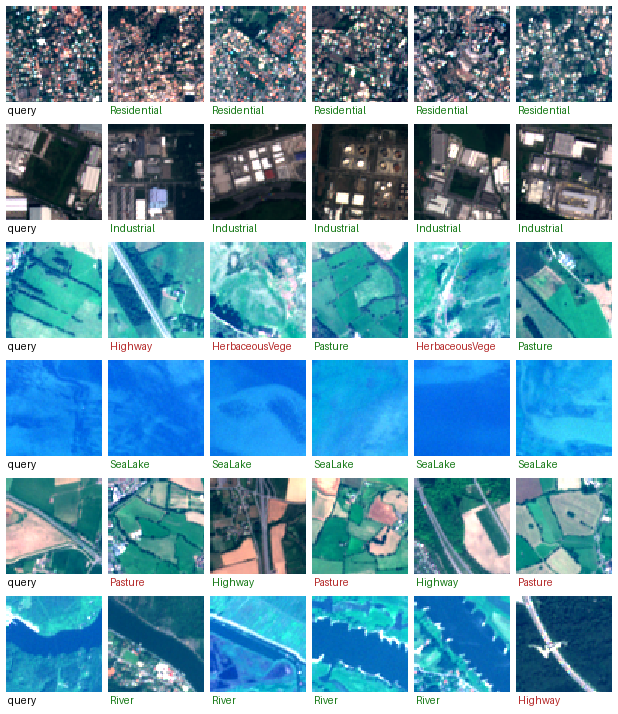

# eo-data-embedding

**Multi-modal geospatial embedding search & change detection on a frozen ViT foundation model.**

Turn Earth-observation archives into a queryable intelligence layer: embed **Sentinel-2 (optical)
+ Sentinel-1 (SAR)** imagery with a pretrained vision-transformer foundation model
([Clay v1.5](https://madewithclay.org/)), then do **similarity search**, **few-shot classification**,
and **change detection** straight on the frozen embeddings — no training from scratch.

[:material-github: Source on GitHub](https://github.com/AstroCan17/eo-data-embedding){ .md-button .md-button--primary }
[:material-rocket-launch: Try the CPU demo](#try-it-cpu-no-gpu){ .md-button }

---

## Headline results

| Task | Result | Baseline |
|---|---|---|
| **Few-shot probe** (50 labels/class, frozen Clay) | **0.895 ± 0.011** macro-F1 | 0.859 supervised CNN |
| **Few-shot probe** (5 labels/class) | **0.761** macro-F1 | 0.547 CNN — **+21 F1 at 5 labels** |
| **Similarity search** (FAISS) | **precision@10 0.822 · mAP@10 0.774** | 8× random chance |
| **Cross-modal** SAR↔optical (+ linear map) | **17× chance** (median rank 32→8) | 5× chance frozen |
| **Change detection** (OSCD, supervised Δ-probe) | **F1 0.510 / IoU 0.342 / Kappa 0.231** | fine-tuned baseline band |

Frozen embeddings buy **label efficiency**, not supremacy — the foundation-model value
proposition. Every number is reproducible and every negative result is reported honestly; see the
[decision records](research/README.md) for the full analysis.

## Try it (CPU, no GPU)

```bash
git clone https://github.com/AstroCan17/eo-data-embedding.git
cd eo-data-embedding
pip install -e .
eo-data-embedding demo        # downloads EuroSAT + an ~8 MB bundle, opens :7860
```

`eo-data-embedding demo` is plug-and-play: it downloads EuroSAT and a small bundle of **precomputed
frozen-Clay embeddings + the trained few-shot probe**, then serves a Gradio UI. Hit **🎲 random
tile** for a fresh held-out EuroSAT scene — the probe predicts its land-use class (✅/❌ vs truth)
and FAISS shows the nearest neighbours. No GPU, no 2 GB Clay checkpoint, no training at runtime.



## How it works

```
satellite image → [Clay backbone: frozen ViT] → 1024-d embedding → {FAISS search · few-shot probe · Δ-change probe}
```

The expensive part — Clay producing embeddings — is run once. Everything downstream (search,
classification, change detection) operates on the frozen vectors with small, cheap heads. The
[decision records](research/README.md) document the dataset, model, and methodology choices behind
each result, including the cloud-infrastructure story and the honest negatives.
